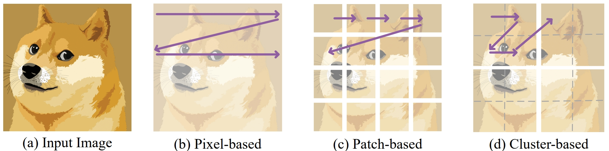

# ARM
This repository is the official implementation of our  [**Autoregressive Pretraining with Mamba in Vision**](https://arxiv.org/abs/2406.07537)



## Introduction
The vision community has started to build with the recently developed state space model, Mamba, as the new backbone for a range of tasks. This paper shows that Mamba's visual capability can be significantly enhanced through autoregressive pretraining, a direction not previously explored. Efficiency-wise, the autoregressive nature can well capitalize on the Mamba's unidirectional recurrent structure, enabling faster overall training speed compared to other training strategies like mask modeling. Performance-wise, autoregressive pretraining equips the Mamba architecture with markedly higher accuracy over its supervised-trained counterparts and, more importantly, successfully unlocks its scaling potential to large and even huge model sizes. For example, with autoregressive pretraining, a base-size Mamba attains 83.2\% ImageNet accuracy, outperforming its supervised counterpart by 2.0\%; our huge-size Mamba, the largest Vision Mamba to date, attains 85.0\% ImageNet accuracy (85.5\% when finetuned with 384×384 inputs), notably surpassing all other Mamba variants in vision.

## Pretraining
```bash
torchrun --standalone --nproc_per_node=8 --master_port 1221 main_pretrain.py \
--batch_size 256 \
    --model arm_base_pz16 \
    --norm_pix_loss \
    --epochs 1600 \
    --warmup_epochs 40 \
    --blr 1.5e-4 --weight_decay 0.05 \
    --data_path /path/to/ImageNet/ --output_dir ./out_b/

torchrun --standalone --nproc_per_node=8 --master_port 1221 main_pretrain.py \
--batch_size 128 \
    --model arm_large_pz16 \
    --norm_pix_loss \
    --epochs 1600 \
    --warmup_epochs 40 \
    --blr 1.5e-4 --weight_decay 0.05 \
    --data_path /path/to/ImageNet/ --output_dir ./out_l/
```

## Finetuning
```bash
cd Finetuning
torchrun --standalone --nproc_per_node 8 main_finetune.py --batch_size 128 \
    --model arm_base_pz16 --finetune ./checkpoint-1599.pth \
    --epochs 100 --global_pool True \
    --blr 5e-4 --layer_decay 0.65 --ema_decay 0.99992 \
    --weight_decay 0.05 --drop_path 0.1 --reprob 0.25 --mixup 0.8 --cutmix 1.0 \
    --dist_eval --data_path /path/to/ImageNet --output_dir ./out_finetune_b/

cd Finetuning
torchrun --standalone --nproc_per_node 8 main_finetune.py --batch_size 32 --accum_iter 4 \
      --model arm_large_pz16 --finetune ./checkpoint-1599.pth\
      --epochs 100 --global_pool True  --ema_decay 0.99992 \
      --blr 5e-4 --layer_decay 0.75 \
      --weight_decay 0.05 --drop_path 0.3 --reprob 0.25 --mixup 0.8 --cutmix 1.0 \
      --dist_eval --data_path /data1/data/ImageNet --output_dir ./out_finetune_l/
```

## Checkpoint
The pretrained models are available at [[huggingface🤗](https://huggingface.co/OliverRen/ARM)]

## ✍ Citation
```
@misc{ren2024autoregressive,
      title={Autoregressive Pretraining with Mamba in Vision}, 
      author={Sucheng Ren and Xianhang Li and Haoqin Tu and Feng Wang and Fangxun Shu and Lei Zhang and Jieru Mei and Linjie Yang and Peng Wang and Heng Wang and Alan Yuille and Cihang Xie},
      year={2024},
      eprint={2406.07537},
      archivePrefix={arXiv},
      primaryClass={cs.CV}
}
```
If you have any question, feel free to contact [Sucheng Ren](https://oliverrensu.github.io/) :)


